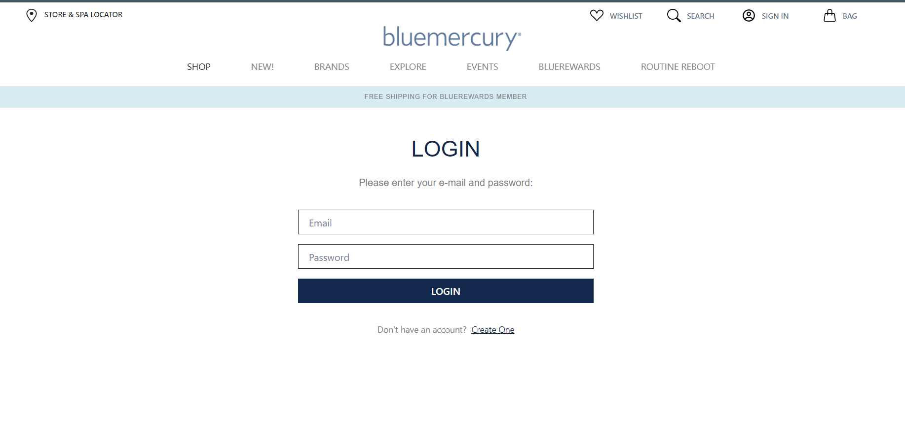

<h1>Bluemercury.com clone Project</h1>

Bluemercury was founded in 1999 as an online shopping website for luxury cosmetics. The co-founders Marla Malcolm (later Marla Malcolm Beck) became CEO and Barry Beck became COO. However, luxury brands that Bluemercury courted were unsure whether they wanted to sell their goods on the internet, while consumers were not accustomed to buying cosmetics without trying them first.

<h1>About this Project</h1>

This is a team project built by us in the construct week of Unit - 5 at Masai School.

<h1>Our Team Members :</h1>

<ul>
<li>Parth Deshmukh</li>
<li>Sandip Suryawanshi</li>
<li>Akshay Pandey </li>
<li>Prakash Dsouza</li>
<li>Ramanna Bandapu</li>
</ul>

<h1>Pages & Features</h1>

<ul>
<li>Home Page : Nav Bar with required links & tooltip in the header.</li>
<li>Sign Up & Login : User can signup & then login using the same credentials he/she used while signing up.</li>

<li>Product Category Pages : Separate product pages for each catergory like beauty, makeup e.t.c.</li>
<li>Cart : User can see, update quanity & remove items which he has added to cart.</li>
<li>Checkout Page : User can check all the products one last time before proceeding to pay.</li>
<li>Payment Page : User can fill his/her card details & if card details are right payment will be successful.</li>
</ul>

<h1>Tech Stack used :</h1>
<ul>
<li>HTML</li>
<li>CSS</li>
<li>JavaScript</li>
<li>React.js</li>
<li>Node.js</li>
<li>Mongodb</li>
<li>Chakra ui</li>
</ul>

<h2>Screenshots :</h2>

<h3>Home Page</h3>

<h3>Login and Sign up Page</h3>

<h3>Product Page</h3>

<h3>  cart </h3>

<h3>Checkout Page<h3>

<h3>Contact info<h3>

<h3>Payment Page<h3>

<h1>
Learnings:</h1>

<ul>
<li>We became proficient in reading the code of our team members & merging them with other codes manually.</li>
<li>We learnt how to collaborate & work in a team & the importance of assigning proper roles to each member.
</li>
<li>We also learnt how to deal with stressful situations like when your code is looking alright to you but isn’t working.</li>

<li>We learnt the importance of having a good mentor. Our Instructional Associates were very much helpful to us. They helped us whenever we asked them for help.</li>
<li>Our skills in JavaScript,chakra ui and react.js became better.</li>
<li>We all learned how to plan project and execution.</li>

</ul>

<h1>Deployed Link On Netlify</h1>
<a  href="https://affable-scissors-7552.vercel.app/" target="_blank">https://affable-scissors-7552.vercel.app/</a>
